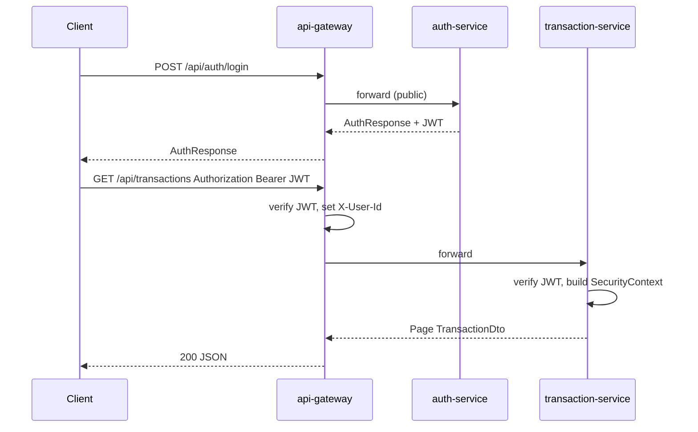
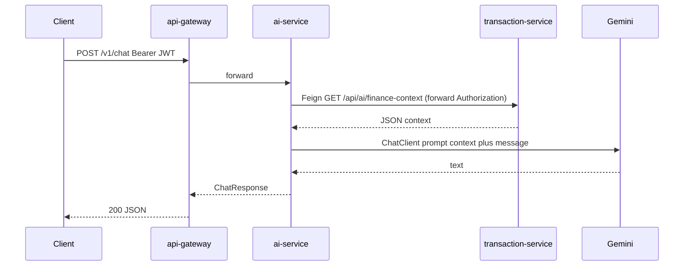
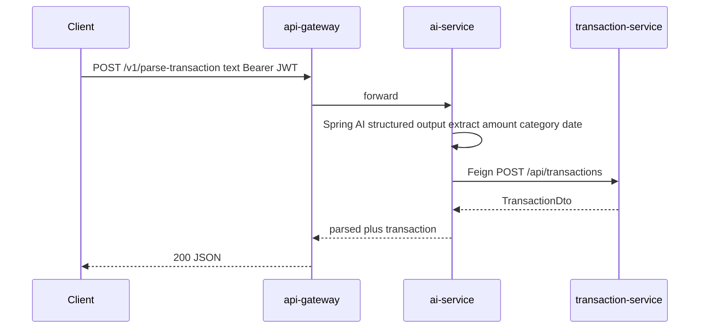

# Thiết kế hệ thống — Quản lý tài chính cá nhân thông minh (Spring Cloud Microservices)

Tài liệu mô tả **bounded context**, **luồng dữ liệu**, **giao tiếp giữa service**, và **chiến lược bảo mật** trong kiến trúc Spring Cloud.

---

## 1. Nguyên tắc thiết kế

1. **Single source of truth**: mỗi bounded context có DB riêng. Không service nào đọc/ghi trực tiếp DB của service khác — luôn qua REST/Feign.
2. **LLM không phải cơ sở dữ liệu**: `ai-service` chỉ **sinh văn bản / gợi ý / parse**; mọi ghi giao dịch đi qua `transaction-service` REST.
3. **Zero-trust**: mỗi service tự verify JWT (cùng `JWT_SECRET`) — không tin tưởng mạng nội bộ.
4. **Stateless service**: scale ngang được; trạng thái session nằm ở JWT phía client.
5. **Discovery + load-balance**: gọi nhau bằng tên service qua Eureka + OpenFeign, không hardcode URL.

---

## 2. Bounded context

### 2.1 auth-service (port 8081, DB `auth_db`)

- Entity: `User`, `UserPreferences`.
- Endpoint: `POST /api/auth/register`, `POST /api/auth/login`, `GET /api/auth/profile`, `GET/PUT /api/auth/preferences`.
- Phát hành **JWT HS256** (TTL 12h, claim `sub=userId`, `username`, `email`).

### 2.2 transaction-service (port 8082, DB `transaction_db`)

- Entity: `Category`, `Transaction`, `SpendingPattern`.
- Endpoint: CRUD `/api/categories`, CRUD/filter `/api/transactions`.
- TODO: `GET /api/ai/finance-context` (snapshot cho AI), `/api/transactions/summary`.

### 2.3 budget-service (port 8083, DB `budget_db`) — skeleton

- Entity: `Budget`.
- TODO: CRUD `/api/budgets`, `GET /api/budgets/{id}/usage` (Feign `transaction-service`).

### 2.4 notification-service (port 8084, DB `notification_db`) — skeleton

- Entity: `Notification`.
- TODO: list/mark-read endpoint, gửi email qua `JavaMailSender`, Feign tới `auth-service` để lấy email.

### 2.5 ai-service (port 8085, không DB) — skeleton + chat

- Endpoint: `POST /v1/chat` (working stub), `POST /v1/parse-transaction` (501 TODO), `GET /v1/predictions` (TODO).
- Spring AI Vertex Gemini; Feign tới `transaction-service` cho `finance-context`.

### 2.6 api-gateway (port 8080)

- Spring Cloud Gateway reactive, route `lb://service-name`.
- `JwtAuthenticationFilter` (order `-100`): bypass public path, verify HS256, inject `X-User-Id`, `X-Username`.
- CORS toàn cục.

### 2.7 discovery-server, config-server

- Eureka 8761; Config Server 8888 đọc `infra/config-repo` (profile `native`).

---

## 3. Luồng điển hình

### 3.1 Đăng nhập + truy cập dữ liệu

### 3.2 Chat AI có ngữ cảnh tài chính

### 3.3 Parse câu thành giao dịch (TODO)

---

## 4. Dữ liệu và trạng thái

- **PostgreSQL**: 4 instance độc lập (`auth_db`, `transaction_db`, `budget_db`, `notification_db`). Migration Flyway riêng.
- **AI service**: stateless. Có thể thêm Redis cho rate-limit / cache prompt sau.
- **Cross-DB**: chỉ lưu ID rời (`Long userId`, `Long categoryId`); không `@ManyToOne` qua boundary.

---

## 5. Tương lai (không bắt buộc lúc đầu)

- **Message broker** (RabbitMQ/Kafka): event "BudgetExceeded" từ `budget-service` → `notification-service` thay vì REST đồng bộ.
- **Outbox pattern** trong `transaction-service` để publish event sau khi tạo giao dịch.
- **Saga / orchestration** cho parse-transaction (rollback nếu Feign fail).
- **OpenTelemetry** trace giữa client → gateway → service → DB; tích hợp Grafana/Loki/Tempo.
- **Spring Cloud Bus + RabbitMQ** để broadcast `/actuator/refresh` khi đổi cấu hình.

---

## 6. Liên kết tài liệu

- Stack: [tech-stack.md](tech-stack.md)
- Cấu trúc: [project-structure.md](project-structure.md)
- API: [api-conventions.md](api-conventions.md), backend: [backend-conventions.md](backend-conventions.md)
- Bảo mật: [security.md](security.md)
