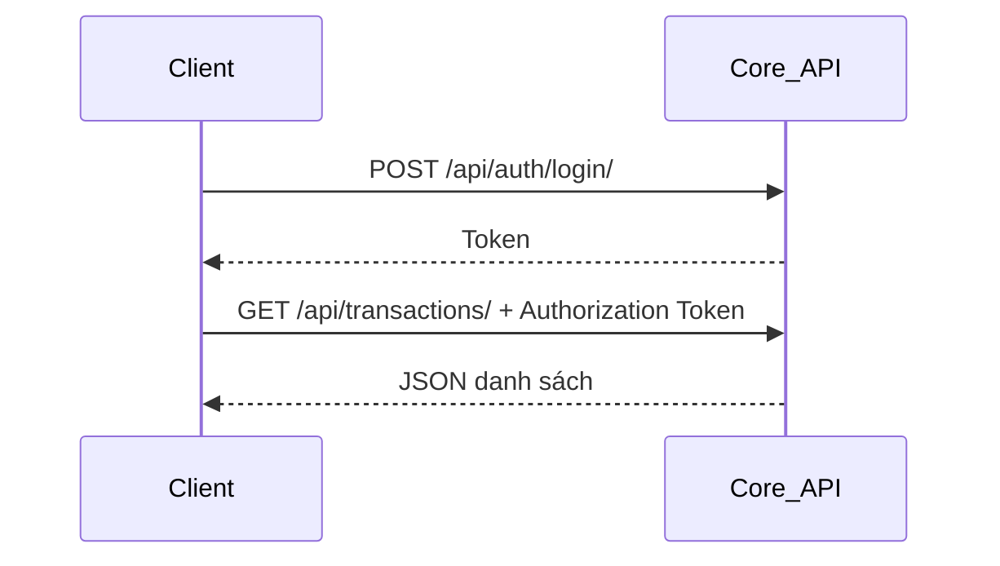
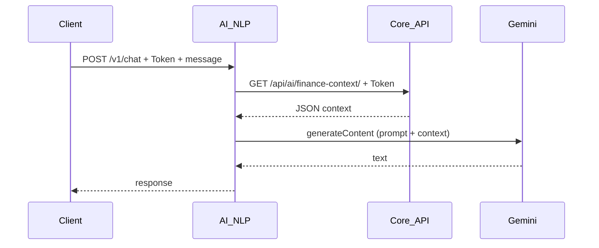
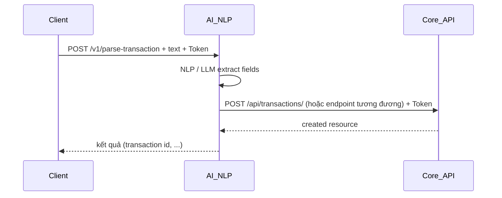

# Thiết kế hệ thống — Quản lý tài chính cá nhân thông minh (Microservices)

Tài liệu mô tả **ranh giới service**, **luồng dữ liệu**, và **các thành phần logic** của hệ tích hợp **AI/NLP** trong kiến trúc tách **Core (Django)** và **AI (FastAPI)**.

---

## 1. Nguyên tắc thiết kế

1. **Single source of truth**: mọi trạng thái tài chính người dùng (giao dịch, ngân sách, …) chỉ tồn tại trong **PostgreSQL** phía Core, truy cập qua **ORM Django** và **API có xác thực**.
2. **LLM không phải cơ sở dữ liệu**: Gemini chỉ **sinh văn bản / gợi ý / parse**; không được coi là nguồn số liệu chính thức.
3. **Least privilege cho AI service**: AI nhận **token của user** và gọi Core như một **client đã đăng nhập** — không mở “cửa hậu” shared secret cho dữ liệu cá nhân (trừ khi thiết kế lại có kiểm soát rõ).
4. **Tách triển khai**: Core và AI scale độc lập; client (web/mobile) biết hai endpoint cơ bản.

---

## 2. Phân chia trách nhiệm chi tiết

### 2.1 Core API (Django + DRF)

Giữ và xử lý:

- **Identity & session**: đăng ký/đăng nhập, token DRF.
- **Domain tài chính**: Category, Transaction, Budget, Notification, UserPreferences, SpendingPattern (theo implementation thực tế trong app `finance`).
- **REST CRUD** và các endpoint đồng bộ/OCR theo monolith hiện có.
- **Thống kê & AI cục bộ** (không Gemini): ví dụ `/api/ai/trends`, `/api/ai/anomalies`, `/api/ai/savings-suggestions`.
- **Dự đoán cục bộ**: `/api/ai/predictions` (phiên bản không dùng Gemini).
- **OCR** hóa đơn (giới hạn kích thước file, validation) — xem [security.md](security.md).
- **`GET /api/ai/finance-context/`**: tổng hợp snapshot tài chính (đủ cho prompt LLM, không leak dữ liệu nhạy cảm không cần thiết — thiết kế field trong serializer/view).

### 2.2 AI / NLP Service (FastAPI)

Giữ và xử lý:

- **Chat** với Gemini, kèm ngữ cảnh lấy từ Core (`finance-context`).
- **Predictions** nâng cao với Gemini; **fallback** sang Core local khi LLM lỗi hoặc không cấu hình.
- **Parse NLP**: nhận chuỗi tự nhiên → map sang payload tạo giao dịch → **`POST`** qua Core API (không INSERT trực tiếp).

### 2.3 Client (Frontend)

- Gọi Core cho mọi màn hình CRUD, báo cáo, cài đặt.
- Gọi AI cho chat, parse, và (nếu product yêu cầu) predictions LLM.
- **Không** nhúng khóa Gemini; chỉ biến môi trường public-safe — xem [frontend-conventions.md](frontend-conventions.md).

---

## 3. Luồng điển hình

### 3.1 Đăng nhập và truy cập dữ liệu

### 3.2 Chat AI có ngữ cảnh tài chính

### 3.3 Parse câu thành giao dịch

---

## 4. Dữ liệu và trạng thái

- **PostgreSQL**: một instance cho Core (hiện tại). Tách DB theo service khi đội ngũ cần độc lập hoàn toàn về schema lifecycle.
- **AI service**: stateless về DB người dùng; có thể thêm **Redis** sau cho rate limit, cache context ngắn hạn, hoặc idempotency key cho parse.

---

## 5. Tương lai (không bắt buộc)

- **Message queue** (Celery/RabbitMQ/Kafka) cho thông báo/email bất đồng bộ.
- **API Gateway** (Traefik/Kong) phía trước Core + AI: TLS chấm dứt, rate limit, routing `/api` vs `/v1`.
- **Observability**: OpenTelemetry trace từ client → Core → AI; log correlation id — gợi ý header `X-Request-ID` trong [api-conventions.md](api-conventions.md).

---

## 6. Liên kết tài liệu

- Ranh giới implementation code: [backend-conventions.md](backend-conventions.md), [api-conventions.md](api-conventions.md)
- FE: [frontend-conventions.md](frontend-conventions.md)
