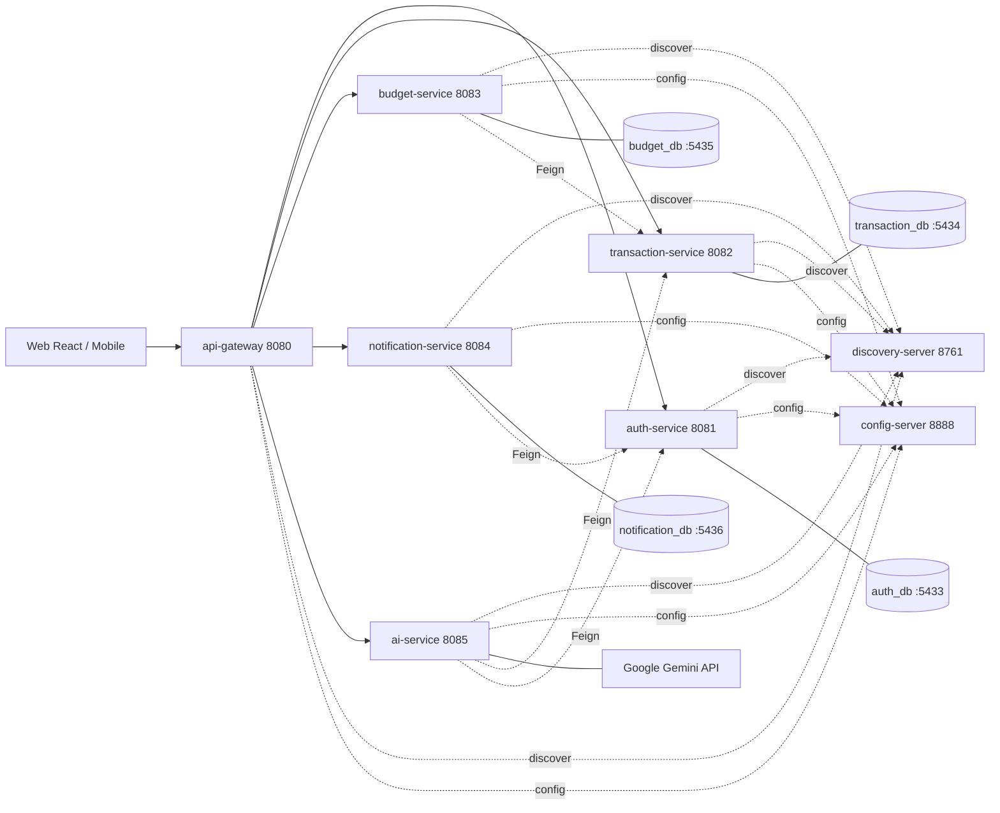

# Hệ thống quản lý tài chính cá nhân thông minh — Spring Cloud Microservices

Repo này triển khai **ứng dụng quản lý tài chính cá nhân** theo kiến trúc **Spring Cloud microservices**: tách bounded context, **database-per-service**, **service discovery (Eureka)**, **centralized config (Spring Cloud Config)**, **API gateway (Spring Cloud Gateway)**, **JWT auth**, và **Spring AI + Google Gemini** cho phần AI/NLP.

---

## 1. Tầm nhìn và phạm vi

### 1.1 Mục tiêu sản phẩm

- **Quản lý chủ động**: ghi nhận thu/chi, phân loại, ngân sách, nhắc nhở, tùy chỉnh giao diện và hành vi.
- **Hiểu sâu**: xu hướng chi tiêu, phát hiện bất thường, gợi ý tiết kiệm — tính cục bộ trong service nghiệp vụ, không phụ thuộc LLM.
- **Tương tác tự nhiên**: người dùng mô tả bằng ngôn ngữ hàng ngày ("cà phê 45k chiều nay") → `ai-service` parse và tạo giao dịch qua `transaction-service` (không bypass auth).
- **Trợ lý hội thoại**: chat theo **ngữ cảnh tài chính** (số dư, gần đây chi gì) — LLM chỉ nhận **bối cảnh đã tổng hợp**, không thay thế nguồn sự thật dữ liệu.

### 1.2 Ranh giới trách nhiệm

| Lớp | Trách nhiệm |
|-----|-------------|
| `api-gateway` | Single entry point, validate JWT, inject `X-User-Id`, `X-Username`, CORS |
| `discovery-server` | Eureka — đăng ký và khám phá service |
| `config-server` | Cấu hình tập trung cho mọi service (profile `native`) |
| `auth-service` | User, đăng ký/đăng nhập, **phát hành JWT**, profile, preferences |
| `transaction-service` | Category, Transaction, SpendingPattern, finance-context cho AI |
| `budget-service` | Budget theo danh mục/chu kỳ, tính usage qua Feign |
| `notification-service` | Thông báo in-app + email (`JavaMailSender`) |
| `ai-service` | Spring AI + Gemini: chat, parse NLP, predictions; gọi service khác qua **Feign + JWT forward** |

---

## 2. Kiến trúc tổng quan



- **Database-per-service**: 4 PostgreSQL instance độc lập. Không FK chéo DB.
- **Sync giao tiếp**: REST + Spring Cloud OpenFeign (load-balanced qua Eureka).
- **Async (tương lai)**: thêm RabbitMQ/Kafka cho event "budget exceeded" → notification.

Chi tiết: [.claude/rules/system-design.md](.claude/rules/system-design.md), [.claude/rules/tech-stack.md](.claude/rules/tech-stack.md).

---

## 3. Cấu trúc thư mục repo

```
finance-microservices/
  pom.xml                              # Parent multi-module Maven
  README.md
  AGENTS.md
  .env.example
  .gitignore
  .claude/                             # Rules, agents, commands
  .cursor/rules/finance-microservices.mdc
  infra/
    docker-compose.yml
    config-repo/                       # Cấu hình native cho config-server
  services/
    config-server/                     # Spring Cloud Config Server (8888)
    discovery-server/                  # Eureka Server (8761)
    api-gateway/                       # Spring Cloud Gateway + JWT (8080)
    auth-service/                      # User + JWT + preferences (8081)
    transaction-service/               # Category + Transaction (8082)
    budget-service/                    # Budget (8083, skeleton)
    notification-service/              # Notification + email (8084, skeleton)
    ai-service/                        # Chat/NLP/Spring AI Gemini (8085, skeleton)
```

Chi tiết: [.claude/rules/project-structure.md](.claude/rules/project-structure.md).

---

## 4. Chạy nhanh (Docker)

Yêu cầu: Docker 24+ và Docker Compose v2.

```bash
cd finance-microservices
cp .env.example .env
cd infra
docker compose up --build
```

| Service | URL |
|---------|-----|
| API Gateway (entry point) | `http://localhost:8080` |
| Eureka dashboard | `http://localhost:8761` |
| Config Server | `http://localhost:8888/auth-service/default` |
| auth-service (direct) | `http://localhost:8081/actuator/health` |
| transaction-service | `http://localhost:8082/actuator/health` |
| budget-service | `http://localhost:8083/actuator/health` |
| notification-service | `http://localhost:8084/actuator/health` |
| ai-service | `http://localhost:8085/actuator/health` |
| Postgres (auth/tx/budget/notif) | `localhost:5433-5436` |

Client **chỉ cần** trỏ vào `http://localhost:8080`.

---

## 5. Chạy local không Docker

Yêu cầu: **JDK 21**, **Maven 3.9+**, 4 PostgreSQL DB (port 5433–5436) hoặc dùng `docker compose up postgres-auth postgres-transaction postgres-budget postgres-notification`.

Build toàn bộ:

```bash
mvn -DskipTests clean install
```

Chạy theo thứ tự (mỗi lệnh một terminal):

```bash
mvn -pl services/config-server -am spring-boot:run
mvn -pl services/discovery-server -am spring-boot:run
mvn -pl services/api-gateway -am spring-boot:run
mvn -pl services/auth-service -am spring-boot:run
mvn -pl services/transaction-service -am spring-boot:run
mvn -pl services/budget-service -am spring-boot:run
mvn -pl services/notification-service -am spring-boot:run
mvn -pl services/ai-service -am spring-boot:run
```

---

## 6. Xác thực — JWT Bearer

1. **Đăng ký**: `POST http://localhost:8080/api/auth/register` body JSON `{username, email, password, firstName?, lastName?}` → `AuthResponse` chứa `token`.
2. **Đăng nhập**: `POST http://localhost:8080/api/auth/login` → `AuthResponse`.
3. **Mọi request khác**:

```http
Authorization: Bearer <jwt>
```

`api-gateway` verify JWT, trích `sub`/`username` thành header `X-User-Id`, `X-Username` cho downstream. Mỗi service tự verify lại JWT (zero-trust) — yêu cầu cùng `JWT_SECRET`.

---

## 7. Mapping endpoint (so với phiên bản Python cũ)

| Trước (Django/FastAPI) | Sau (Spring Cloud) |
|------------------------|--------------------|
| `POST /api/auth/login/` (DRF Token) | `POST /api/auth/login` → JWT (gateway 8080) |
| `Authorization: Token <key>` | `Authorization: Bearer <jwt>` |
| `GET /api/transactions/` | `GET /api/transactions?page=&size=&fromDate=&toDate=&categoryId=` |
| `GET /api/categories/` | `GET /api/categories` |
| `POST /api/chatbot/` | `POST /v1/chat` |
| `POST /api/.../nlp_input/` | `POST /v1/parse-transaction` (TODO scaffold) |
| `GET /api/ai/finance-context/` | `GET /api/ai/finance-context` (transaction-service, TODO) |

---

## 8. Công nghệ (tóm tắt)

- **Java 21 LTS**, **Maven multi-module**.
- **Spring Boot 3.3.x**, **Spring Cloud 2024.0.x**.
- **Spring Cloud Gateway** (reactive), **Eureka**, **Config Server**, **OpenFeign**.
- **Spring Web (MVC)**, **Spring Data JPA**, **Spring Security**, **Spring Validation**, **Spring Mail**.
- **Flyway**, **PostgreSQL 16**.
- **JJWT 0.12.x**, **Lombok**, **MapStruct**.
- **Spring AI** (Vertex Gemini starter) cho `ai-service`.
- **JUnit 5 + Testcontainers** cho test.

Chi tiết: [.claude/rules/tech-stack.md](.claude/rules/tech-stack.md).

---

## 9. Bảo mật và vận hành

- Không commit `.env`, JWT secret, GCP credentials. Xem [.claude/rules/security.md](.claude/rules/security.md).
- `docker compose` ở môi trường dev; production khuyến nghị Kubernetes + secret manager (Vault / GCP Secret Manager).
- Rate limit, TLS termination: cấu hình ở `api-gateway` hoặc reverse proxy phía trước.
- Git workflow: [.claude/rules/git-workflow.md](.claude/rules/git-workflow.md).

---

## 10. Repo monolith tham chiếu

Mã nguồn monolith gốc (Django): [Django-Finance-Manager](../). Microservices repo này độc lập về schema và lifecycle; có thể tách thành remote riêng.

---

## 11. Tài liệu cho AI / Cursor

- [.claude/rules/](.claude/rules/) — quy tắc kỹ thuật đầy đủ
- [.claude/agents/](.claude/agents/) — vai trò agent (backend-spring, ai-service, gateway-infra, frontend-react, qa)
- [.claude/commands/](.claude/commands/) — review/deploy/fix-issue
- [.cursor/rules/finance-microservices.mdc](.cursor/rules/finance-microservices.mdc) — gợi ý ngắn cho Cursor
