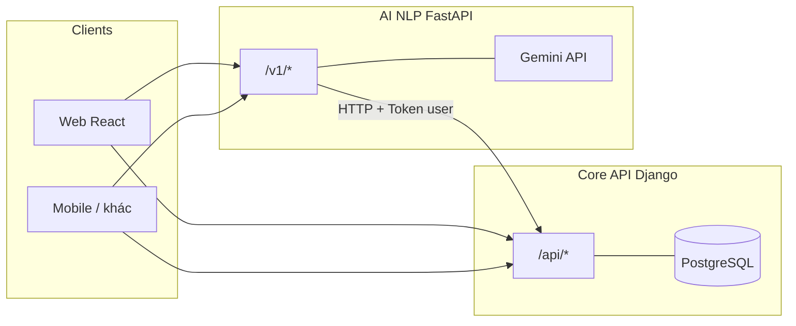

# Hệ thống quản lý tài chính cá nhân thông minh — Kiến trúc Microservices

Repo này triển khai **ứng dụng quản lý tài chính cá nhân** theo hướng **tách service**: **Core Finance API** (Django REST Framework, PostgreSQL) đảm nhiệm **toàn bộ dữ liệu và nghiệp vụ CRUD**, còn **AI/NLP Service** (FastAPI, Google Gemini) đảm nhiệm **hội thoại thông minh, dự đoán nâng cao (LLM), và phân tích ngôn ngữ tự nhiên** để tạo giao dịch — **mọi ghi cơ sở dữ liệu** vẫn đi qua Core với **xác thực token người dùng**.

---

## 1. Tầm nhìn và phạm vi

### 1.1 Mục tiêu sản phẩm

- **Quản lý chủ động**: ghi nhận thu/chi, phân loại, ngân sách, nhắc nhở, tùy chỉnh giao diện và hành vi.
- **Hiểu sâu**: xu hướng chi tiêu, phát hiện bất thường, gợi ý tiết kiệm (một phần tính **cục bộ** trên Core, không phụ thuộc LLM).
- **Tương tác tự nhiên**: người dùng mô tả bằng ngôn ngữ hàng ngày (“cà phê 45k chiều nay”) → hệ thống **parse** và tạo giao dịch qua API.
- **Trợ lý hội thoại**: chat theo **ngữ cảnh tài chính** (số dư, gần đây chi gì) — LLM chỉ nhận **bối cảnh đã tổng hợp** từ Core, không thay thế nguồn sự thật dữ liệu.

### 1.2 Ranh giới trách nhiệm

| Lớp | Trách nhiệm |
|-----|-------------|
| **Core** | Auth token, mô hình dữ liệu, migrations, REST `/api/`, OCR hóa đơn, thống kê & AI cục bộ, endpoint `finance-context` cho LLM |
| **AI/NLP** | Gemini chat, Gemini predictions (có fallback), parse NLP → gọi API Core tạo giao dịch |
| **Client (FE)** | Hai base URL (Core + AI), một token sau đăng nhập — **không** chứa khóa Gemini |

Chi tiết quy chuẩn code và định dạng:

- **Backend**: [.claude/rules/backend-conventions.md](.claude/rules/backend-conventions.md)
- **Frontend**: [.claude/rules/frontend-conventions.md](.claude/rules/frontend-conventions.md)
- **Thiết kế hệ thống**: [.claude/rules/system-design.md](.claude/rules/system-design.md)
- **API**: [.claude/rules/api-conventions.md](.claude/rules/api-conventions.md)

---

## 2. Kiến trúc tổng quan



- **Một** PostgreSQL cho Core (mô hình *database-per-service* có thể áp dụng khi tách thêm service sau).
- AI service **không** lưu trạng thái người dùng lâu dài; có thể bổ sung cache (Redis) sau cho session/chat.

---

## 3. Cấu trúc thư mục repo

| Thư mục | Mô tả |
|---------|--------|
| [services/core-api](services/core-api) | Django: auth, categories, transactions, budgets, notifications, preferences, thống kê AI cục bộ (`/api/ai/*` **không** dùng Gemini trực tiếp) |
| [services/ai-nlp-service](services/ai-nlp-service) | FastAPI: chat Gemini, dự đoán Gemini, `POST /v1/parse-transaction` |
| [infra](infra) | `docker-compose.yml` (PostgreSQL + hai service) |
| [.claude](.claude) | Rules, agents, commands phục vụ phát triển có hỗ trợ AI |
| [AGENTS.md](AGENTS.md) | Hướng dẫn agent / developer |

Cấu trúc file chi tiết: [.claude/rules/project-structure.md](.claude/rules/project-structure.md).

---

## 4. Chạy nhanh (Docker)

Từ thư mục `infra/`:

```bash
cd infra
docker compose up --build
```

- **Core API**: `http://localhost:8000/api/`
- **AI service**: `http://localhost:8001/docs` (OpenAPI)
- **PostgreSQL**: `localhost:5432` (user/pass `postgres`/`postgres`, DB `finance_db`)

Đặt `GEMINI_API_KEY` (xem [.env.example](.env.example)). Trên Windows PowerShell có thể:

```powershell
$env:GEMINI_API_KEY="your_key"
docker compose up --build
```

---

## 5. Chạy local (không Docker)

1. Tạo venv, cài `services/core-api/requirements.txt`, chạy migrate, `runserver` cổng `8000`.
2. Cài `services/ai-nlp-service/requirements.txt`, đặt `CORE_API_BASE_URL=http://127.0.0.1:8000`, chạy:

```bash
cd services/ai-nlp-service
uvicorn app.main:app --reload --port 8001
```

### 5.1. Lệnh chạy chi tiết trên Windows (PowerShell)

Mở 3 terminal riêng.

Terminal 1 - Core API (Django):

```powershell
cd services/core-api
python -m venv .venv
.\.venv\Scripts\Activate.ps1
pip install -r requirements.txt
python manage.py migrate
python manage.py init_categories
python manage.py runserver 0.0.0.0:8000
```

Terminal 2 - AI/NLP Service (FastAPI):

```powershell
cd services/ai-nlp-service
python -m venv .venv
.\.venv\Scripts\Activate.ps1
pip install -r requirements.txt
$env:CORE_API_BASE_URL="http://127.0.0.1:8000"
$env:GEMINI_API_KEY="your_gemini_api_key"
$env:GEMINI_MODEL="gemini-2.0-flash"
uvicorn app.main:app --reload --port 8001
```

Terminal 3 - Frontend React (Vite):

```powershell
cd ..\..\frontend
npm install
npm run dev
```

Mặc định frontend chạy tại `http://localhost:3000` và đã proxy sẵn:

- `/api/*` -> `http://localhost:8000` (Core API)
- `/v1/*` -> `http://localhost:8001` (AI service)

Không cần cấu hình CORS thêm cho môi trường dev khi chạy qua Vite proxy.

### 5.2. Biến môi trường frontend (tùy chọn)

Frontend hỗ trợ ghi đè endpoint bằng biến môi trường Vite:

- `VITE_CORE_API_URL` (mặc định `/api`)
- `VITE_AI_API_URL` (mặc định `/v1`)

Ví dụ file `frontend/.env.local`:

```env
VITE_CORE_API_URL=/api
VITE_AI_API_URL=/v1
```

---

## 6. Xác thực

Cả **Core** và **AI** dùng **cùng kiểu token** DRF như monolith:

```http
Authorization: Token <key>
```

Token thu được sau `POST /api/auth/login/` trên Core. Frontend gửi header này tới **cả hai** service khi đã đăng nhập.

---

## 7. Mapping endpoint (monolith → microservices)

| Trước (monolith) | Sau |
|------------------|-----|
| `POST /api/chatbot/` | `POST http://localhost:8001/v1/chat` (AI) |
| `GET /api/ai/predictions/` (Gemini) | `GET http://localhost:8001/v1/predictions` (Gemini, fallback Core local) |
| `GET /api/ai/predictions/` (chỉ local) | `GET http://localhost:8000/api/ai/predictions/` (Core) |
| `POST .../transactions/nlp_input/` | `POST http://localhost:8001/v1/parse-transaction` |
| Còn lại (`/api/auth/*`, CRUD, sync, OCR, …) | Core `http://localhost:8000/api/...` |

Core cung cấp **`GET /api/ai/finance-context/`** — JSON tổng hợp cho Gemini (AI service gọi nội bộ với token user).

---

## 8. Công nghệ (tóm tắt)

Xem đầy đủ [.claude/rules/tech-stack.md](.claude/rules/tech-stack.md):

- **Core**: Python 3.12+, Django 6, DRF, PostgreSQL, Token auth, CORS.
- **AI**: FastAPI, Uvicorn, httpx, Gemini.
- **Client tham chiếu**: React + Vite + Tailwind; biến `VITE_CORE_API_URL`, `VITE_AI_API_URL`.

---

## 9. Bảo mật và vận hành

- Không commit secret; Gemini chỉ trên env AI service — [.claude/rules/security.md](.claude/rules/security.md).
- Git workflow: [.claude/rules/git-workflow.md](.claude/rules/git-workflow.md).

---

## 10. Repo monolith tham chiếu

Mã nguồn monolith gốc: [Django-Finance-Manager](../). Có thể khởi tạo git trong thư mục microservices và đẩy lên remote độc lập nếu cần.

---

## 11. Tài liệu cho AI / Cursor

- [.claude/rules/](.claude/rules/) — quy tắc kỹ thuật đầy đủ
- [.cursor/rules/finance-microservices.mdc](.cursor/rules/finance-microservices.mdc) — gợi ý ngắn cho Cursor
